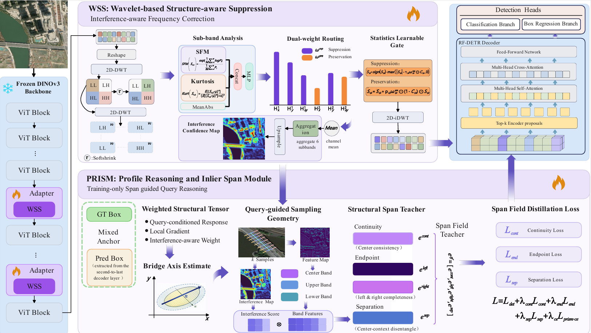
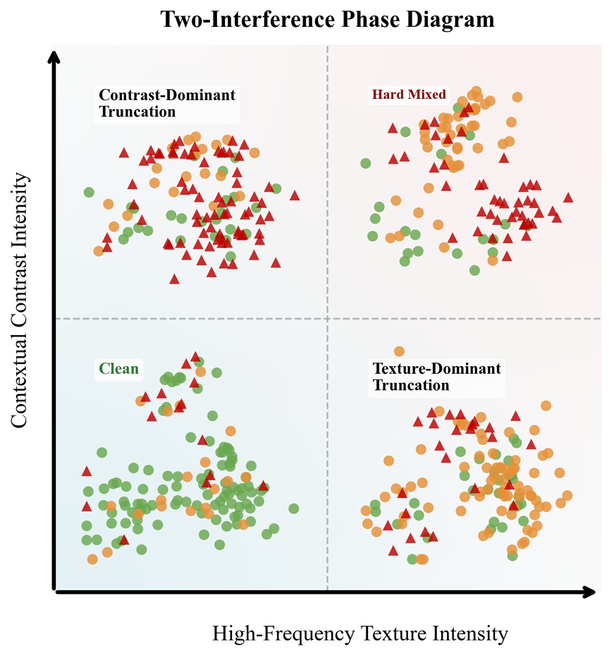
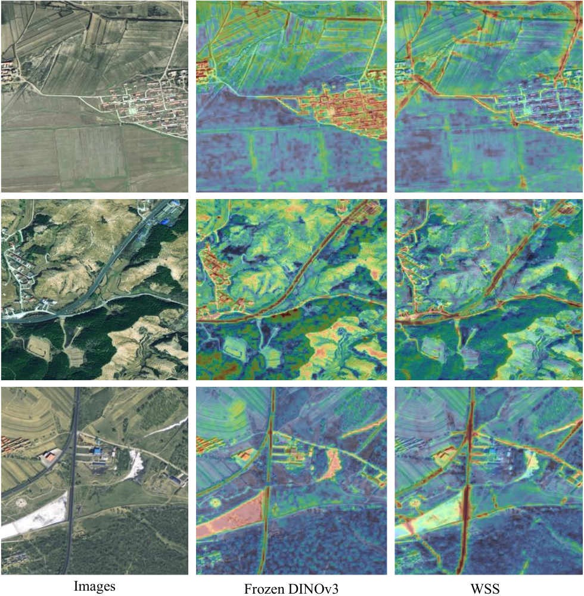
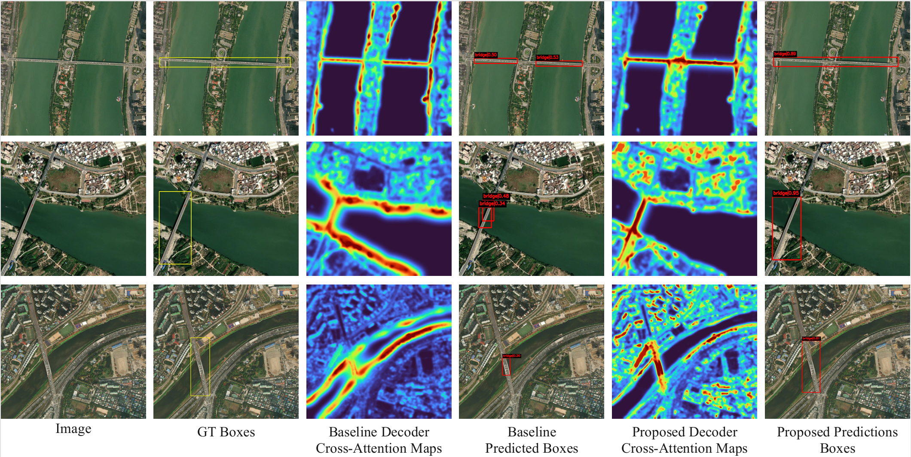

# BridgeWiseNet: Interference-Aware Bridge Detection in Remote Sensing Images with Vision Foundation Models

  
  
  
  
  
  

  <a href="#news--updates">News</a> •
  <a href="#overview">Overview</a> •
  <a href="#method">Method</a> •
  <a href="#main-results">Results</a> •
  <a href="#qualitative-visualization">Visualization</a> •
  <a href="#datasets">Datasets</a> •
  <a href="#repository-structure">Structure</a> •
  <a href="#getting-started">Getting Started</a> •
  <a href="#citation">Citation</a>

---

## News / Updates

- **2026-04**: Repository initialized.
- **2026-04**: README, method overview, and benchmark summary released.
- **Coming soon**: training code, evaluation scripts, pretrained checkpoints, and dataset instructions.

---

## Overview

Bridge detection in high-resolution remote sensing images (HRSIs) is important for infrastructure monitoring, disaster assessment, traffic analysis, and rapid emergency response. However, under the **frozen-transfer** setting of Vision Foundation Models (VFMs), directly adapting generic pretrained representations to bridge detection remains difficult.

BridgeWiseNet is motivated by a simple observation: bridge detection failures in frozen VFMs should **not** be treated as one undifferentiated clutter problem. Instead, two recurrent interference modes dominate performance degradation:

1. **Texture-dominated high-frequency interference**, which mainly corrupts **feature-level evidence competition**.
2. **Contextual contrast interference**, which mainly disrupts **query-level span reasoning** and often causes endpoint truncation.

To address them in a coordinated way, we propose **BridgeWiseNet**, an interference-aware framework with two complementary components:

- **WSS**: Wavelet Subband Suppression for structure-preserving feature rectification.
- **PRISM**: Profile Reasoning and Inlier Span Module for training-only span-aware query supervision.

In addition, we build **MBDDv2**, an expanded bridge detection benchmark with broader scene coverage and richer bridge diversity.

---

## Highlights

- Reformulates frozen-transfer bridge detection as a **mechanism-aware interference modeling** problem.
- Explicitly decomposes failure modes into **feature-stage HF interference** and **query-stage contextual ambiguity**.
- Introduces **WSS** to suppress nuisance-dominated HF responses while preserving bridge-supportive structure.
- Introduces **PRISM** to regularize continuity, endpoint integrity, and center-context separation **without adding inference-time overhead**.
- Achieves strong reproduced benchmark results on **MBDDv2** and **GLH-Bridge**.

---

## Method

  

### 1. WSS: Wavelet Subband Suppression

WSS is inserted into later blocks of the frozen VFM backbone. It performs a fixed two-level Haar wavelet decomposition on token-grid features and uses subband statistics to perform **suppression-preservation routing**.

Its goal is not generic smoothing, but **interference-aligned feature rectification**:

- suppress diffuse nuisance-dominated HF responses,
- preserve bridge-supportive structural detail,
- and export an explicit spatial cue map for downstream span reasoning.

### 2. PRISM: Profile Reasoning and Inlier Span Module

PRISM is a **training-only** auxiliary branch. It uses matched decoder queries, GT boxes, neck features, and the cue map exported by WSS to construct a structured span-field teacher.

PRISM supervises three aspects of bridge reasoning:

- **continuity**
- **endpoint integrity**
- **center-context separation**

Importantly, **PRISM is removed during inference**, so it improves optimization while keeping the deployed detector unchanged.

### 3. Unified Design

BridgeWiseNet is not a loose combination of wavelet processing and distillation. Its key idea is to correct the two interference modes **at the stages where they actually arise**:

- **WSS** handles feature-level HF corruption.
- **PRISM** handles query-level span ambiguity.
- The **cue map from WSS** links feature rectification with query supervision.

---

## Main Results

### Benchmark performance

| Method | Backbone | MBDDv2 AP | MBDDv2 AP50 | MBDDv2 AP75 | GLH-Bridge AP | GLH-Bridge AP50 | GLH-Bridge AP75 |
|:--|:--|--:|--:|--:|--:|--:|--:|
| BridgeWiseNet | DINOv3-ViT-L/16 | **27.8** | **56.7** | **25.4** | **35.5** | **73.9** | **33.9** |

### Efficiency

| Variant | Params (M) | FLOPs (T) | FPS |
|:--|--:|--:|--:|
| BridgeWiseNet (deployed) | **313.5** | **4.12** | **4.0** |

### Key takeaways

- BridgeWiseNet improves AP50 by **2.7 points** over the vanilla frozen-VFM baseline on **MBDDv2**.
- BridgeWiseNet improves AP50 by **1.8 points** over the vanilla frozen-VFM baseline on **GLH-Bridge**.
- WSS improves the feature substrate by reallocating HF responses toward bridge-supportive regions.
- PRISM reduces span truncation under strong contextual contrast, while introducing **no inference-time overhead**.

---

## Qualitative Visualization

### Interference phase diagram

  

Bridge detection failures under frozen VFMs are not randomly distributed. They concentrate in two mechanism-distinct regimes:
texture-dominant interference and contrast-dominant interference.

### WSS visualization

  

WSS suppresses background-dominated HF competition while preserving bridge-relevant structural cues.

### PRISM visualization

  

PRISM improves span completeness and reduces endpoint mirage under strong contextual boundaries.

---

## Datasets

### MBDDv2

MBDDv2 is an expanded bridge detection benchmark built upon the original MBDD dataset.

- **30,914** optical HRSIs
- **42,318** manually annotated bridge instances
- image size: **1024 × 1024**
- supports both **horizontal** and **rotated** bounding boxes

### GLH-Bridge

GLH-Bridge is a large-scale benchmark for bridge detection in very-high-resolution optical imagery.

- **6,000** optical images
- **59,737** bridge instances
- spatial resolution: **0.3 m to 1.0 m**
- image sizes from **2048 × 2048** to **16384 × 16384**

> In this repository, horizontal boxes are used for detector training and primary benchmarking, while rotated annotations are used for selected bridge-aligned geometric analyses.

---
